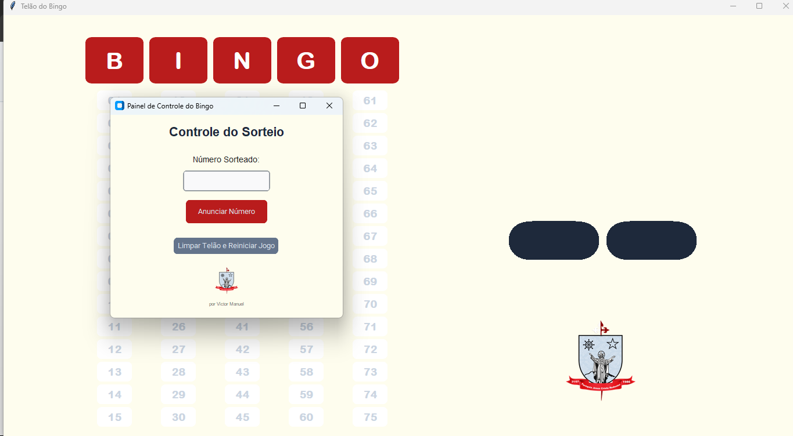

# 📺 Bingo Display System (BDS)

Um sistema prático para exibir os números sorteados de um bingo em tempo real, ideal para telões, TVs ou projetores.

<p align="center">
  
  
  
</p>

---

## 🧩 Funcionalidades

- 📢 Sorteio de números aleatórios de 1 a 75  
- 🎯 Exibição em tempo real com destaque visual  
- ⛔ Garante que não repita os números já sorteados  
- 🖥️ Interface de visualização em tela cheia  
- 🎛️ Controles simples para operar durante o evento  

---

## 🖼️ Capturas de Tela

<p align="center">
  
</p>

---

## 🚀 Instalação e Uso

### 1. Requisitos

- Python 3.8 ou superior  
- Bibliotecas:  
  - `tkinter`  
  - `customtkinter`  
  - `Pillow` (se usar imagens)

### 2. Instalação

Clone o repositório e instale as dependências:

```bash
git clone https://github.com/Vectorgg15/BDS.git
cd BDS
pip install -r requirements.txt

### 3. Execução

python main.py

---

## 📄 Arquivos e Formato

Para gerar as cartelas, você precisará de dois arquivos: uma **Planilha Excel** com os dados e um **Modelo SVG** para o design.

## ⚙️ Como Funciona

O programa inicia com a tela principal do bingo. Ao clicar no botão Sortear, um número aleatório entre 1 e 75 será exibido com destaque e registrado no histórico. A interface foi otimizada para ser visível de longe, ideal para eventos públicos.

🧠 Dica: Para melhorar a visualização em um telão ou TV, pressione F11 para colocar a janela em tela cheia (dependendo do sistema operacional).

---

## 🧑‍💻 Autor

Desenvolvido por Victor Manuel com 💙 para tornar bingos mais organizados, modernos e interativos.
